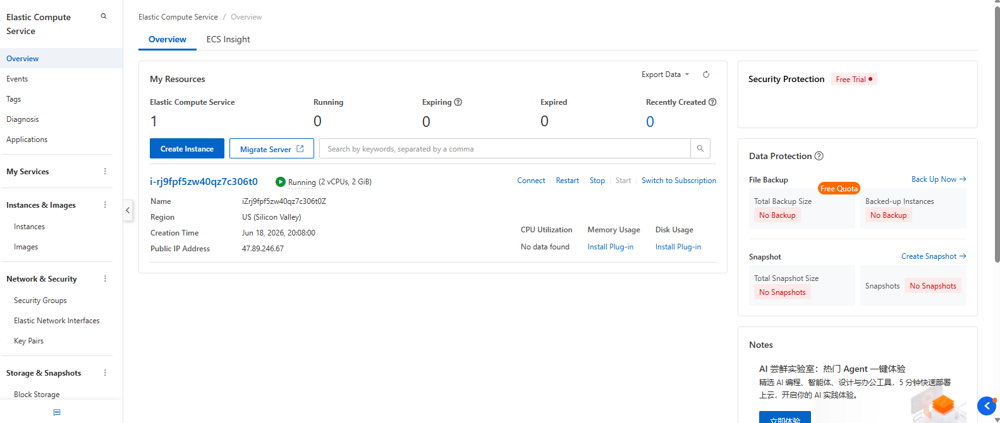

# Alibaba Cloud Deployment

This file documents the live deployment of Qwen MemoryAgent on Alibaba Cloud infrastructure, as required for hackathon submission eligibility.

## Infrastructure

| Item | Value |
|---|---|
| Service | Alibaba Cloud Elastic Compute Service (ECS) |
| Instance Type | Economy Type e — 2 vCPU / 2 GiB |
| OS | Ubuntu 22.04 64-bit |
| Region | US (Silicon Valley) |
| Billing | Pay-as-you-go |
| Instance ID | `i-rj9fpf5zw40qz7c306t0` |

## Proof of Deployment


Instance `i-rj9fpf5zw40qz7c306t0` shown live in the Alibaba Cloud ECS console, status: Running, public IP `47.89.246.67`, US (Silicon Valley) region.

## Services Running

Both backend services run directly on the ECS instance via `nohup` + `uvicorn`:

```bash
nohup python3 memory_api.py > memory_api.log 2>&1 &
nohup python3 agent.py > agent.log 2>&1 &
```

- `memory_api.py` → port `8000` — core memory CRUD, Qwen scoring, recall, forget
- `agent.py` → port `8001` — chat layer, memory injection, frontend host

## Verified Health Checks

Run from outside the instance (proving public reachability over Alibaba Cloud's network):

```
GET http://<ECS-public-ip>:8000/health
→ {"status":"healthy","timestamp":"2026-06-19T01:44:57.301718"}

GET http://<ECS-public-ip>:8001/health
→ {"status":"ok","service":"MemoryAgent Chat"}
```

## End-to-End Functional Test

A full chat turn was executed against the live Alibaba Cloud deployment, confirming:
- Qwen Cloud API connectivity (chat completion + embeddings) from the ECS instance
- Neon Postgres (pgvector) connectivity for memory storage/recall
- Upstash Redis connectivity for caching
- Weighted deduplication and conflict resolution (SKIP / UPDATE / NEW) working end-to-end
- Importance-first recall ranking and memory injection working end-to-end on the deployed instance

```
POST http://<ECS-public-ip>:8001/chat
Body: {"user_id":"nidhi","message":"hello, testing new api key"}

Response (truncated):
{
  "reply": "Hello again, Nidhi! It looks like the new API key for your Qwen MemoryAgent project is working perfectly...",
  "context_injected": true,
  "memories_used": [ ...memories recalled via pgvector, importance-first ranking... ],
  "memories_stored": [ ...newly extracted memories, deduplicated and conflict-checked before insert... ]
}
```

## Security Group Configuration
Inbound rules opened on the ECS security group to allow external access:
| Port | Protocol | Source | Purpose |
|---|---|---|---|
| 22 | TCP | 24.216.78.74/32 (developer IP) | SSH management |
| 8000 | TCP | 0.0.0.0/0 | memory_api.py |
| 8001 | TCP | 0.0.0.0/0 | agent.py + frontend |

## Architecture

See [`architecture.md`](./architecture.md) for the full system diagram showing how Qwen Cloud, Alibaba Cloud ECS, Neon, and Upstash connect.

## Notes

- All credentials (Qwen API key, database URL, Redis URL) are stored in a `.env` file on the instance, excluded from version control via `.gitignore`.
- Credentials used during development/testing were rotated prior to final submission as a security precaution.
- Services are configured to auto-restart detached from the SSH session via `nohup`, ensuring uptime independent of any single terminal connection.
- Instance is stopped between work sessions to conserve free-tier credit; restarted via the ECS console before each deployment verification or demo recording. Pay-as-you-go billing only charges for active runtime hours.
- Deployed code is kept in sync with the `main` branch via `git pull` on the instance before each verification pass.
- **Auth was added after the End-to-End Functional Test above was captured** — that example predates `JWT_SECRET`/login existing at all, so its request/response shape (`user_id` in the body, `memories_stored` populated inline) reflects the API as it was at that time, not the current one. Left as-is since it's a historical verification record, not living documentation — see `README.md`'s API Reference for the current shape.
- On any future redeploy: `JWT_SECRET` must be set to the **same** value in both `memory_api.py`'s and `agent.py`'s `.env` on the instance — they verify tokens independently rather than one delegating to the other, so a mismatch between the two fails every token check with no obvious error pointing at the cause.