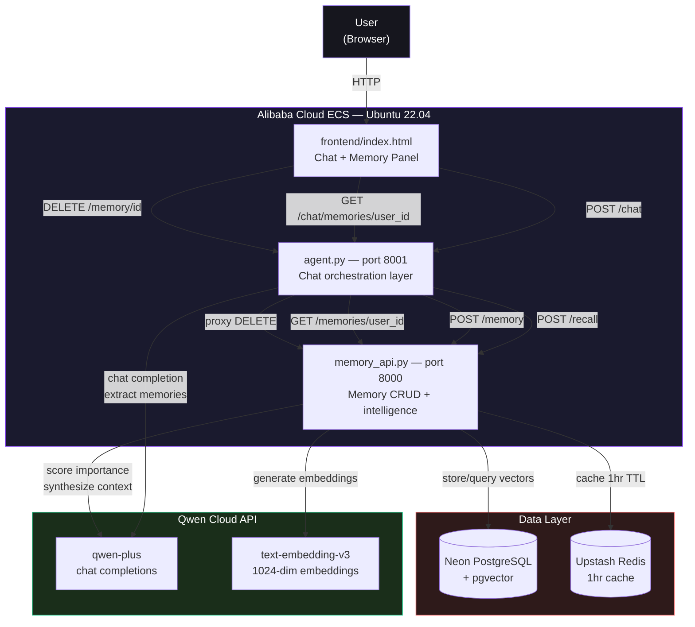
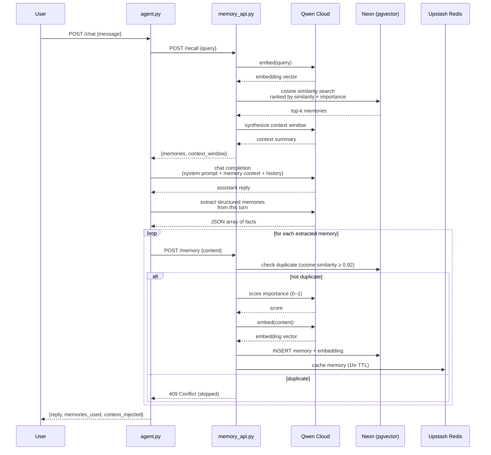
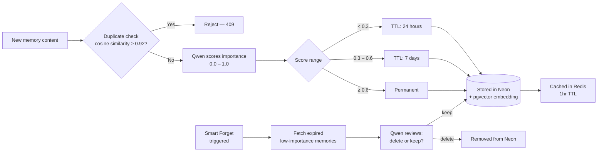

# Architecture

System architecture for Qwen MemoryAgent — Track 1: MemoryAgent, Global AI Hackathon with Qwen Cloud.

## Diagram

## Request Flow — Chat Turn

## Memory Lifecycle

## Component Responsibilities

| Component | Responsibility |
|---|---|
| **frontend/index.html** | Chat UI, live memory panel, session management, delete controls |
| **agent.py** | Orchestrates chat turns: recall → prompt assembly → Qwen call → memory extraction → storage. Proxies delete requests. |
| **memory_api.py** | Owns all memory intelligence: importance scoring, embedding generation, semantic recall, context synthesis, deduplication, smart forgetting, CRUD |
| **Qwen Cloud (qwen-plus)** | Chat completions for: user-facing replies, importance scoring, context synthesis, memory extraction |
| **Qwen Cloud (text-embedding-v3)** | 1024-dimension embeddings for semantic search and duplicate detection |
| **Neon PostgreSQL + pgvector** | Persistent storage for memories and their vector embeddings; cosine similarity search |
| **Upstash Redis** | Short-term cache (1hr TTL) for recently stored memories |
| **Alibaba Cloud ECS** | Hosts both backend services (`memory_api.py`, `agent.py`) — see [`DEPLOYMENT.md`](./DEPLOYMENT.md) |

## Why This Design

**Two services instead of one** — `memory_api.py` is a standalone, reusable memory layer with its own API contract. `agent.py` is a thin orchestration layer on top. This separation means the memory system could plug into a different agent/chat layer without modification, and is independently testable.

**Recall ranks by `similarity × importance`** — rather than pure semantic similarity, so a highly important memory with moderate relevance can still outrank a trivial memory with high relevance.

**Two-step memory write (extract, then store)** — instead of storing the raw user message, `agent.py` asks Qwen to extract structured facts first. This produces cleaner, more reusable memories ("User prefers concise explanations") instead of noisy raw text ("yeah I guess I'd rather you keep it short tbh").

**Deduplication at write time** — checks cosine similarity against existing memories before storing, preventing the same fact from being re-stored every session (a common failure mode in naive memory systems).
