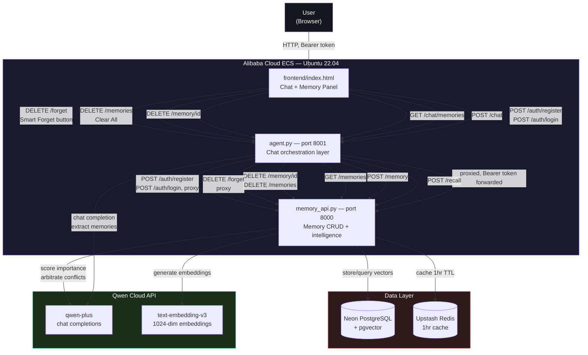
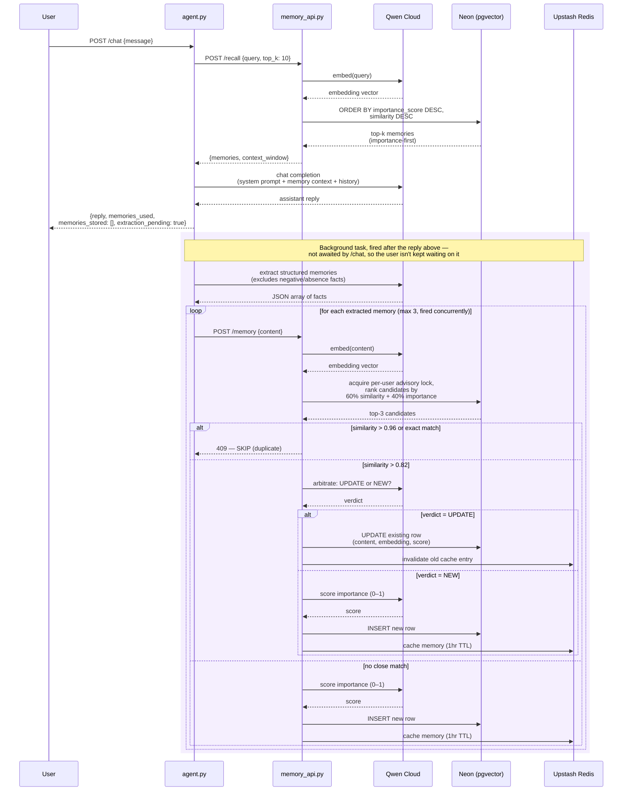
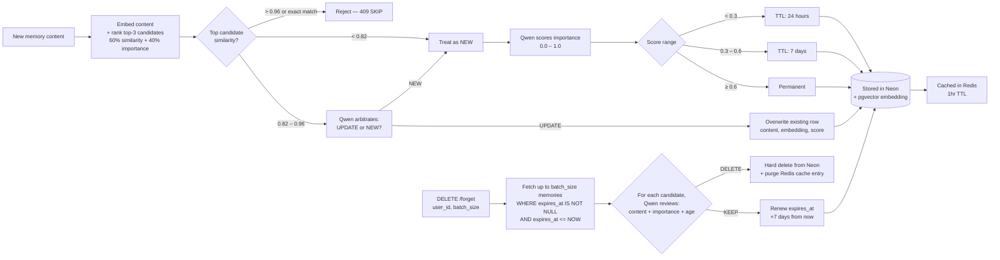

# Architecture

System architecture for Qwen MemoryAgent — Track 1: MemoryAgent, Global AI Hackathon with Qwen Cloud.

**The hardest problem here wasn't storing memories — it was knowing when a new memory should overwrite an old one instead of duplicating it.** If a user says "I prefer Python" today and "I've switched to Rust" next week, a naive system either ends up with two contradictory facts forever, or blindly overwrites things that were actually meant to coexist. The conflict-arbitration system below (`manage_duplicates_and_conflicts` in `memory_api.py`) is the answer to that, and it's the part of this project worth looking at most closely.

## Diagram

## Request Flow — Chat Turn

## Memory Lifecycle

## Component Responsibilities

| Component | Responsibility |
|---|---|
| **frontend/index.html** | Login/register UI, chat UI, live memory panel, session management, delete controls |
| **agent.py** | Orchestrates chat turns: recall → prompt assembly → Qwen call, returning the reply immediately; memory extraction → storage runs afterward as a background task. Proxies delete and auth requests. Independently verifies the same JWTs memory_api.py issues. |
| **memory_api.py** | Owns all memory intelligence: importance scoring, embedding generation, semantic recall, context synthesis, deduplication, smart forgetting, CRUD. Also owns user accounts: registration, login, password hashing, JWT issuance. |
| **Qwen Cloud (qwen-plus)** | Chat completions for: user-facing replies, importance scoring, context synthesis, memory extraction |
| **Qwen Cloud (text-embedding-v3)** | 1024-dimension embeddings for semantic search and duplicate detection |
| **Neon PostgreSQL + pgvector** | Persistent storage for memories and their vector embeddings; cosine similarity search |
| **Upstash Redis** | Short-term cache (1hr TTL) for recently stored memories |
| **Alibaba Cloud ECS** | Hosts both backend services (`memory_api.py`, `agent.py`) — see [`Deployment.md`](./Deployment.md) |
| **test_memory_agent.py** | End-to-end test suite — makes live HTTP calls against either deployment to verify every behavior in this document, plus a structural validation pass over `frontend/index.html` |

## Why This Design

**Two services instead of one** — `memory_api.py` is a standalone, reusable memory layer with its own API contract. `agent.py` is a thin orchestration layer on top. This separation means the memory system could plug into a different agent/chat layer without modification, and is independently testable.

**Recall ranks by `similarity × importance`** — rather than pure semantic similarity, so a highly important memory with moderate relevance can still outrank a trivial memory with high relevance.

**Two-step memory write (extract, then store)** — instead of storing the raw user message, `agent.py` asks Qwen to extract structured facts first. This produces cleaner, more reusable memories ("User prefers concise explanations") instead of noisy raw text ("yeah I guess I'd rather you keep it short tbh").

**Deduplication and conflict resolution at write time** — rather than blind dedup, candidate memories are ranked by a blended similarity+importance score and Qwen arbitrates whether a close match should be treated as a duplicate (reject), an update (overwrite the stale fact), or a genuinely new independent memory. This handles the common case where a user's stated preference changes over time ("I prefer Python" → "actually I've switched to Rust") without leaving stale, contradictory memories in the store.

**Extraction and storage run after the reply, not before it** — `agent.py`'s `/chat` used to block on the full embed/dedup/arbitrate/score chain for every extracted fact before responding, even though none of that work is needed to answer the user. `chat_turn` now returns the reply as soon as Qwen produces it; extraction and storage run afterward as a background task (`extract_and_store`). `POST /chat` reflects this in its response shape: `memories_stored` is always `[]` and `extraction_pending: true` signals the work is still in flight — the memory panel picks up newly stored facts on its next refresh rather than from the chat response itself.

**Memory content is framed as data, never instructions** — because stored memories get re-injected into the system prompt of *future*, unrelated sessions, a malicious message stored as a "memory" could otherwise act as a persistent, cross-session jailbreak. The recall system prompt, the extraction prompt, and the conflict-arbitration prompt all explicitly tell Qwen that memory/user content is untrusted data to read, never instructions to obey — including text that impersonates system or admin commands. This is prompt-level defense-in-depth: it meaningfully reduces injection risk but, like any LLM-based defense, isn't a hard guarantee against a sufficiently adversarial input.

## Known Limitations

These are deliberate scope decisions for a hackathon timeline, not oversights — named here so they're explicit rather than discovered by a reader.

~~**User ID is a plain text field, not authentication.**~~ Fixed: both services now require a JWT (`POST /auth/register` / `POST /auth/login`, username + bcrypt-hashed password) on every memory-scoped endpoint. `user_id` is fully removed from request bodies and URL paths — identity comes only from the verified token, via `Depends(get_current_user)` — not just cross-checked against a client-supplied value. `memory_api.py` owns the `users` table and issues tokens; `agent.py` verifies the same tokens independently (shared `JWT_SECRET`, decode-only, no bcrypt/no users table) rather than trusting `memory_api.py`'s verification alone, since `memory_api.py`'s port is also directly publicly reachable. CORS also switched from `allow_origins=["*"]` to a configurable `ALLOWED_ORIGINS` env var.

New limitations that come with this fix, named the same way the ones above are:

**Pre-existing demo data has no ownership continuity.** Memories stored under a given `user_id` string before this change was deployed were never password-protected. The first person to register that exact username afterward gets access to whatever was already stored under it — there's no way to verify "is this legitimately the same person" against data that predates accounts existing at all. Fine for hackathon demo content, would matter for anything real.

**No token revocation or refresh.** Tokens are just short-lived (`JWT_EXPIRE_HOURS`, default 24) — there's no server-side blacklist, so a compromised token remains valid until it naturally expires. Logout is client-side only (clearing the stored token); it doesn't invalidate the token itself.

**No rate limiting on `/auth/login` or `/auth/register`.** Brute-force protection is out of scope — nothing currently slows down repeated failed login attempts against a given username.

**JWT stored in browser `localStorage`.** Readable by any injected script; there's no Content-Security-Policy. The frontend's existing `escapeHtml()` discipline in `appendMessage`/`renderMemories` reduces but doesn't eliminate this exposure.

**`JWT_SECRET` must be provisioned identically to both services.** They verify tokens independently with a shared secret rather than one service delegating to the other — a mismatch between the two `.env` files fails every token verification with no clear error pointing at the actual cause. See `Deployment.md`.

~~**Conflict arbitration is a single Qwen call, not a transaction.**~~ Fixed: `store_memory` now takes a per-`user_id` Postgres advisory lock (`pg_advisory_xact_lock(hashtext(user_id))`) and runs the candidate read, arbitration, and final write inside one transaction, so a concurrent write for the same user can no longer land between the check and the write. Different users never contend with each other. The tradeoff: a pooled connection stays checked out for the full sequence, including the arbitration/scoring Qwen calls, so heavy concurrent write volume across many users could exhaust the connection pool (`max_size=10`) faster than before.

**Importance scoring is a single LLM call per memory, not a learned model.** It's fast to build and genuinely effective (see the calibration rules above), but it means scoring is only as consistent as Qwen's adherence to the prompt — occasional miscalibration is possible and was in fact found and corrected once during testing (see the specific-vs-vague and name-floor rules).

**Smart Forget runs synchronously per request, not on a schedule.** It only reviews memories when `/forget` is explicitly called (via the UI button or API), not automatically in the background. A production system would likely run this as a periodic job instead of a manual trigger.

**Background extraction has no durability.** `extract_and_store` runs as a fire-and-forget `asyncio.Task`, not a persisted job in a queue. A graceful shutdown (FastAPI's shutdown hook, or the CLI loop exiting) drains any in-flight tasks before the process exits, so a normal restart doesn't lose work — but a hard crash or kill between the reply being sent and that task completing loses that turn's extraction silently, with nothing recorded that it was ever attempted. A production version would push extraction onto a durable queue instead of an in-process task.